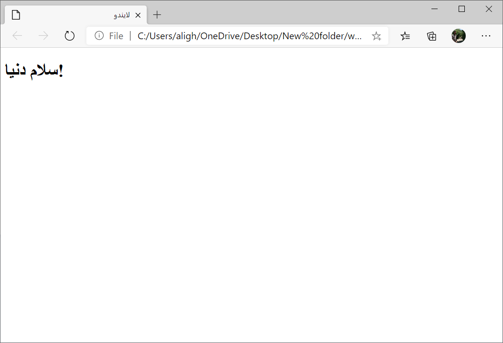

HTML زبان صفحات وب است. با کمک HTML می‌توان صفحات وب را طراحی کرد.
در این آموزش نسخه ۵ این زبان یعنی HTML5 آموزش داده می‌شود.

HTML یک زبان برنامه‌نویسی نیست و برای اجرای آن فقط یک مرورگر مانند گوگل کروم کافیست.

براس ساخت اولین صفحه وب خود، یک فایل متنی ایجاد کنید و متن زیر را در داخل آن کپی کنید:

```html
<!DOCTYPE html>
<html lang="fa">
<head>
    <meta charset="UTF-8">
    <title>لایندو</title>
</head>
<body>
    <h1>
        سلام دنیا!
    </h1>
</body>
</html>
```

فایل به با فرمت 
.html 
ذخیره کنید. 
سپس با مرورگر خود فایل را باز کنید.

خروجی به صورت زیر خواهد بود:



[[warning]]
| فایل متنی رو با نرم افزار Notepad ایجاد کنید. نه برنامه هایی مانند Microsoft Office Word!